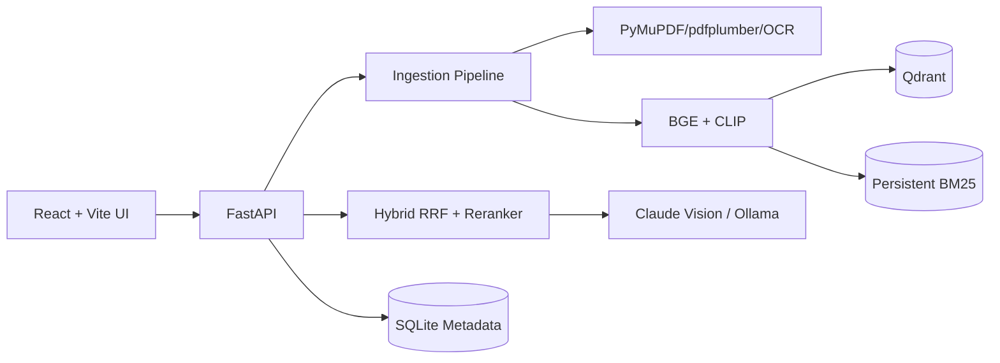

# DocuRAG — AI-Powered Document & Image Search & Analysis

Production-oriented multimodal RAG for PDFs and images. It combines native PDF text, OCR, tables, extracted figures, BGE text embeddings, CLIP image embeddings, BM25, Qdrant, cross-encoder reranking, and Claude/Ollama grounded generation.

## Architecture


## Quick start
```bash
cp .env.example .env
# Set LLM_PROVIDER=anthropic + ANTHROPIC_API_KEY, or run Ollama locally and set OLLAMA_MODEL.
docker compose up --build
```
Open `http://localhost:3000`; API docs are at `http://localhost:8000/docs`.

## API
```bash
curl -F file=@sample.pdf http://localhost:8000/api/documents/upload
curl http://localhost:8000/api/documents
curl -X POST http://localhost:8000/api/query -H 'Content-Type: application/json' -d '{"question":"What is the main finding?","top_k":5}'
curl -N -X POST http://localhost:8000/api/query/stream -H 'Content-Type: application/json' -d '{"question":"Show the chart trend"}'
```

## Features
- PDF/PNG/JPG upload with configurable 50 MB default limit.
- Native text, scanned-page OCR, standalone-image routing.
- Tables converted to Markdown and embedded figures extracted with hash-based VLM caption caching.
- Page-aware chunks with overlap and metadata.
- Qdrant dense retrieval + persistent BM25 + CLIP image retrieval, fused by RRF k=60.
- Optional BGE cross-encoder reranking.
- Claude vision or Ollama provider selected by environment variables; no API keys are hardcoded.
- Grounded answers with `[document, p.X]` citations and exact out-of-scope fallback.
- Confidence score from reranker strength, source agreement and LLM self-check.
- Background ingestion progress, health, feedback and latency metrics.
- Responsive dark-mode React interface with document filters, citations and source viewer.

## CPU-only mode
Set `DEVICE=cpu`, disable reranking/query rewriting if memory is constrained, and use a compact Ollama model. Model files are retained in the Docker `docurag_model_cache` volume.

## Deployment
### Render / Railway
Deploy the backend as a Docker service, expose port 8000, attach persistent storage for `/app/data` and `/models`, and use an external Qdrant service. Deploy the frontend separately and set `VITE_API_BASE_URL`.

### AWS EC2
Install Docker, clone the repository, create `.env`, run `docker compose up -d --build`, and put Nginx/ALB in front of ports 3000/8000 with TLS. Back up the `docurag_qdrant_data` volume and `/app/data`.

## Development
```bash
make test
make lint
make eval
make up
make down
```
CI runs Python compilation/tests and frontend TypeScript validation.

## Troubleshooting
- **Qdrant unavailable:** check `docker compose ps` and port 6333.
- **OCR errors:** switch `OCR_ENGINE=pytesseract`; Tesseract is installed in the backend image.
- **No answer:** ensure ingestion reaches `done`, then query with a document filter.
- **Ollama unavailable:** start Ollama on the host and ensure the configured model is pulled; or use Anthropic.
- **Slow first request:** embedding/reranker/CLIP models are downloaded and loaded lazily into the model volume.

## Project layout
`backend/app/` contains API, ingestion, indexing, retrieval, generation and persistence layers; `frontend/` contains the React UI; `data/` is the persistent local data mount; `.github/workflows/ci.yml` contains CI.
